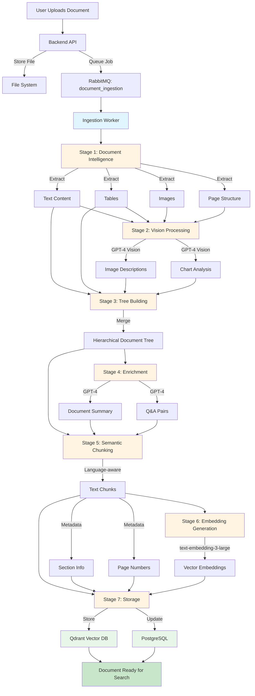
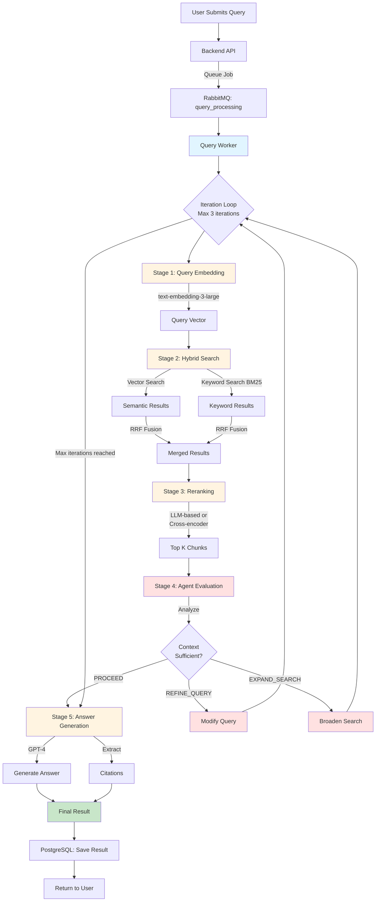
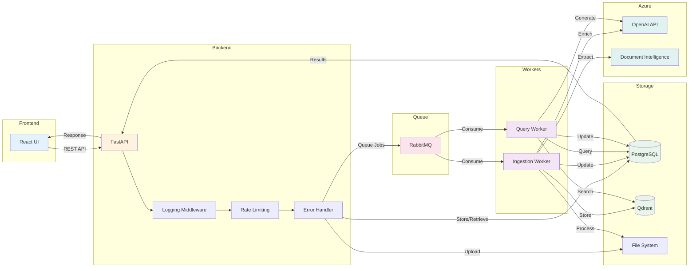

# RAG System Architecture

## Overview

This document provides a comprehensive explanation of the RAG (Retrieval Augmented Generation) System architecture, detailing how documents flow through the ingestion pipeline and how queries are processed to generate intelligent answers.

## System Architecture

The RAG System is built as a microservices architecture using Docker, with the following core components:

### Core Services

1. **PostgreSQL**: Relational database for metadata storage, including documents, queries, chunks, and settings
2. **Qdrant**: Vector database for storing document embeddings and enabling hybrid search
3. **RabbitMQ**: Message queue for asynchronous job processing
4. **Backend API**: FastAPI-based REST API for client interactions
5. **Ingestion Worker**: Processes uploaded documents through a 7-stage pipeline
6. **Query Worker**: Executes agentic query processing with iterative refinement
7. **Frontend**: React-based admin UI for document management and querying

### External Services

- **Azure OpenAI**: GPT-4 for language understanding, summarization, and answer generation
- **Azure OpenAI Embeddings**: text-embedding-3-large for vector embeddings
- **Azure Document Intelligence**: OCR and document structure extraction

---

## Document Ingestion Flow

The document ingestion pipeline transforms uploaded documents into searchable, semantically chunked content with embeddings.

### Ingestion Pipeline Stages



### Detailed Stage Breakdown

#### Stage 1: Azure Document Intelligence
- **Purpose**: Extract raw content and structure from documents
- **Technology**: Azure Document Intelligence API
- **Input**: PDF, DOCX, PPTX, images
- **Output**: 
  - Text paragraphs with coordinates
  - Tables in structured format
  - Embedded images
  - Page layout information

#### Stage 2: Vision Processing
- **Purpose**: Analyze images and charts for semantic meaning
- **Technology**: GPT-4 Vision (Azure OpenAI)
- **Input**: Images extracted from Stage 1
- **Output**: 
  - Natural language descriptions of images
  - Chart data interpretation
  - Diagram explanations

#### Stage 3: Tree Building
- **Purpose**: Create hierarchical document structure
- **Process**: 
  - Merge text content with image descriptions
  - Preserve document hierarchy (sections, subsections)
  - Maintain page relationships
- **Output**: Unified document tree with all content types

#### Stage 4: Enrichment
- **Purpose**: Generate metadata to improve retrieval
- **Technology**: GPT-4 (Azure OpenAI)
- **Output**:
  - Document-level summary
  - Key topics and themes
  - Question-Answer pairs for common queries

#### Stage 5: Semantic Chunking
- **Purpose**: Split document into retrievable units
- **Strategy**: 
  - Respects sentence boundaries
  - Maintains semantic coherence
  - Configurable chunk size (default: 512 tokens)
  - Overlap for context continuity (default: 50 tokens)
- **Output**: Array of text chunks with metadata

#### Stage 6: Embedding Generation
- **Purpose**: Convert text to vector representations
- **Technology**: text-embedding-3-large (Azure OpenAI)
- **Process**: 
  - Generate embeddings for each chunk
  - Dimensionality: 3072 dimensions
- **Output**: Vector embeddings for semantic search

#### Stage 7: Storage
- **Purpose**: Persist chunks and metadata
- **Qdrant Storage**:
  - Vector embeddings
  - Full text for keyword search
  - Chunk metadata (section, page, document_id)
- **PostgreSQL Storage**:
  - Document metadata
  - Chunk count
  - Processing status
  - Enrichment data (summary, Q&A)

---

## Query Processing Flow

The query pipeline uses an agentic approach to iteratively refine searches until sufficient context is found.

### Agentic Query Pipeline



### Detailed Query Stages

#### Stage 1: Query Embedding
- **Purpose**: Convert query to vector representation
- **Technology**: text-embedding-3-large (Azure OpenAI)
- **Output**: 3072-dimensional query vector

#### Stage 2: Hybrid Search
- **Purpose**: Retrieve relevant chunks using multiple methods
- **Methods**:
  1. **Vector Search**: Cosine similarity against embeddings
  2. **BM25 Keyword Search**: Traditional full-text search
  3. **RRF (Reciprocal Rank Fusion)**: Combine both methods
- **Configuration**:
  - Default `top_k`: 10 initial results
  - RRF parameter `k`: 60
- **Output**: Ranked list of chunks with scores

#### Stage 3: Reranking
- **Purpose**: Improve relevance of top results
- **Methods**:
  - LLM-based reranking (GPT-4)
  - Cross-encoder models
- **Process**:
  - Re-score top K chunks (default: 5)
  - Consider query-chunk semantic relationship
  - Account for chunk quality and completeness
- **Output**: Final top K chunks in relevance order

#### Stage 4: Agent Evaluation
- **Purpose**: Determine if context is sufficient to answer query
- **Technology**: GPT-4 (Azure OpenAI)
- **Agent Decisions**:
  1. **PROCEED**: Context is sufficient → Generate answer
  2. **REFINE_QUERY**: Query needs modification → Iterate with new query
  3. **EXPAND_SEARCH**: Need broader context → Iterate with expanded search
- **Constraints**: Maximum 3 iterations to prevent infinite loops

#### Stage 5: Answer Generation
- **Purpose**: Create natural language answer with citations
- **Technology**: GPT-4 (Azure OpenAI)
- **Process**:
  - Synthesize information from retrieved chunks
  - Generate coherent answer
  - Include citations to source chunks
  - Maintain factual accuracy
- **Output**: 
  - Final answer text
  - Array of source citations
  - Confidence metadata

---

## Data Flow Diagram

### Complete System Data Flow



---

## Key Features

### Production-Ready Features

1. **JSON Structured Logging**
   - Request/Correlation ID tracking across services
   - Timestamp, log level, service name in every log
   - Easy integration with log aggregation tools

2. **Rate Limiting**
   - PostgreSQL-based (no Redis dependency)
   - Per-IP and per-API-key limits
   - Configurable: 60 requests/minute, 1000 requests/hour

3. **Global Error Handling**
   - Consistent JSON error responses
   - Automatic exception tracking
   - User-friendly error messages

4. **Health Checks**
   - Individual service health endpoints
   - Dependency health verification
   - Docker health check integration

5. **Async Architecture**
   - Non-blocking I/O throughout
   - Efficient resource utilization
   - High concurrent request handling

### RAG-Specific Features

1. **Hybrid Search**
   - Combines semantic vector search with keyword BM25
   - RRF fusion for optimal results
   - Configurable weights and parameters

2. **Agentic Query Processing**
   - Self-evaluating retrieval adequacy
   - Automatic query refinement
   - Up to 3 iterations for optimal results

3. **Document Intelligence**
   - OCR for scanned documents
   - Table extraction and preservation
   - Image analysis with GPT-4 Vision

4. **Semantic Chunking**
   - Language-aware splitting
   - Respects sentence boundaries
   - Maintains context with overlap

5. **Full Debugging UI**
   - View all query iterations
   - Inspect retrieved chunks before/after reranking
   - Agent decision reasoning
   - Performance timing per stage

---

## Configuration

### Key Environment Variables

#### Azure Services
```env
AZURE_OPENAI_ENDPOINT=https://your-resource.openai.azure.com/
AZURE_OPENAI_API_KEY=your_key_here
AZURE_EMBEDDING_DEPLOYMENT=text-embedding-3-large
AZURE_LLM_DEPLOYMENT=gpt-4
AZURE_DOC_INTELLIGENCE_ENDPOINT=https://your-resource.cognitiveservices.azure.com/
AZURE_DOC_INTELLIGENCE_KEY=your_key_here
```

#### RAG Parameters
```env
# Chunking
CHUNK_SIZE=512              # Tokens per chunk
CHUNK_OVERLAP=50            # Overlap between chunks

# Retrieval
DEFAULT_TOP_K=10            # Initial retrieval count
DEFAULT_RERANK_TOP=5        # Post-rerank count

# Agent
MAX_AGENT_ITERATIONS=3      # Max query refinement loops

# Hybrid Search
RRF_K=60                    # RRF fusion parameter
```

#### Infrastructure
```env
POSTGRES_USER=rag_user
POSTGRES_PASSWORD=your_secure_password
POSTGRES_DB=rag_system
RATE_LIMIT_PER_MINUTE=60
RATE_LIMIT_PER_HOUR=1000
```

---

## Performance Characteristics

### Ingestion Pipeline
- **Typical document (10 pages)**: 30-60 seconds
- **Bottlenecks**: Azure Document Intelligence, GPT-4 Vision
- **Optimization**: Parallel image processing, batch embeddings

### Query Pipeline
- **Single iteration**: 1-3 seconds
- **With refinement (2-3 iterations)**: 3-8 seconds
- **Bottlenecks**: Hybrid search, LLM calls
- **Optimization**: Caching, connection pooling

---

## Scalability Considerations

### Horizontal Scaling
- **Backend API**: Multiple instances behind load balancer
- **Workers**: Scale by adding more containers
- **RabbitMQ**: Cluster for high availability
- **Qdrant**: Distributed mode for large datasets

### Vertical Scaling
- **PostgreSQL**: Increase memory for larger indexes
- **Qdrant**: More RAM for in-memory vector search
- **Workers**: More CPU for faster processing

---

## Security Features

1. **API Key Authentication**: All Azure services use secure API keys
2. **Environment Variables**: Secrets not hardcoded
3. **Rate Limiting**: Prevents abuse and DoS
4. **Input Validation**: Pydantic schemas validate all inputs
5. **SQL Injection Protection**: SQLAlchemy ORM with parameterized queries

---

## Monitoring and Observability

### Logging
- **Format**: JSON structured logs
- **Fields**: timestamp, level, service, request_id, correlation_id
- **Integration**: Compatible with ELK, Splunk, DataDog

### Metrics
- **Request Duration**: Response time headers on all API calls
- **Queue Depth**: RabbitMQ management UI
- **Processing Status**: PostgreSQL document/query status tracking

### Health Checks
- **Endpoint**: `GET /health`
- **Checks**: Database connectivity, queue connectivity, disk space
- **Docker Integration**: Health checks in docker-compose.yml

---

## Future Enhancements

1. **Authentication/Authorization**: User management and access control
2. **Multi-tenancy**: Isolated data per organization
3. **Advanced Reranking**: Fine-tuned cross-encoder models
4. **Caching Layer**: Redis for frequently accessed queries
5. **Distributed Tracing**: OpenTelemetry integration
6. **Backup/Restore**: Automated database and vector store backups
7. **CI/CD Pipeline**: Automated testing and deployment

---

## Conclusion

This RAG System provides a production-ready foundation for building intelligent document Q&A applications. The architecture emphasizes:

- **Reliability**: Error handling, health checks, retries
- **Performance**: Async processing, hybrid search, efficient storage
- **Observability**: Structured logging, timing metrics, debug UI
- **Scalability**: Microservices, queue-based processing, horizontal scaling
- **Flexibility**: Configurable parameters, modular pipeline stages

The agentic query processing with iterative refinement ensures high-quality answers, while the comprehensive ingestion pipeline handles diverse document types with semantic understanding.
